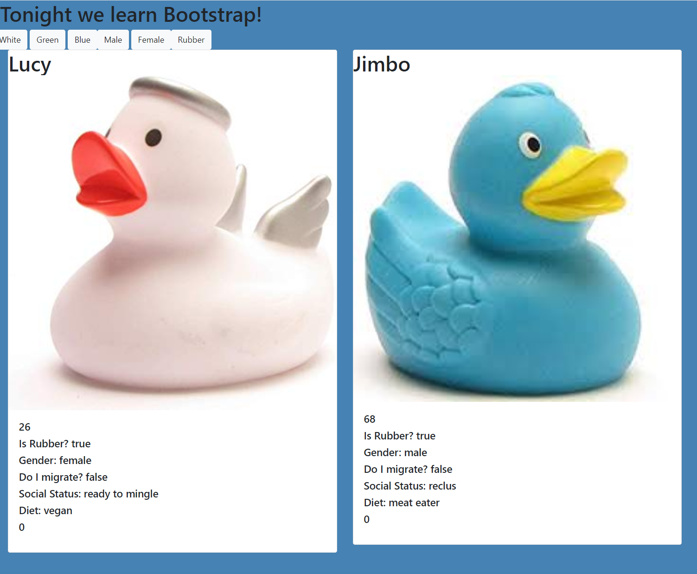

# Title: Ducks! Bootstrap Introduction 

## Description: In this project, we create and array of objects. The goal is to give the user the ability to filter the array with different options, like color, gender. This was also our first exposure to bootstrap. 

## Screenshots

## How To Run
1. Clone down this repo.
1. Make sure you have http-server installed via npm
1. [If you don't have npm, get it here.](https://www.npmjs.com/package/http-server) On you command line, run `hs -p 8080`
1. In your browser, go to `http://localhost:8080/`

